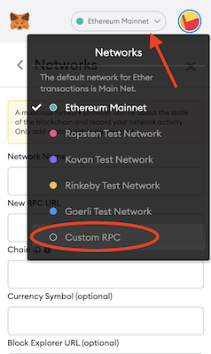
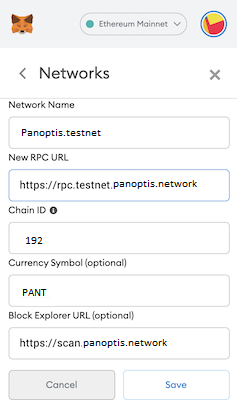

# PulseChain Testnet

The PulseChain Testnet is up and running. This document will guide you through connecting Metamask to the network and bootstrapping a PulseChain node of your own.

> **Disclaimer**: This is a **Testnet**, and issues may arise as the network or certain front-ends see increased load. The team will work diligently to address any issues as they come.

> **Disclaimer 2**: The state of this network may be reset on occasion, and nothing should be considered permanent after the fork block. We will communicate ahead of time when these resets are planned.

## Connecting Metamask

Follow these instructions to manually add the Testnet to your Metamask plugin. A button will be available in the future to do this automatically.

**1. Click the Networks dropdown and select "Custom Network"**

**2. Enter the following information:**
- Network Name: `PulseChain Testnet`
- New RPC URL: `https://rpc.testnet.pulsechain.com`
- Chain ID: `940`
- Currency Symbol: `TPLS`
- Block Explorer URL: `https://scan.pulsechain.com`

|   Step 1    |   Step 2    |
| ----------- | ----------- |
 |  |

**Congratulations**! You are now connected to the PulseChain Testnet. Existing ethereum accounts that had balances as of block `13,224,745` (*Sep-14-2021 03:48:51 PM +UTC*) will have the equivalent on balance on the PulseChain Testnet.

## Getting tPLS to use on the PulseChain Testnet

To get tPLS you can use the tPLS faucet.

1. Navigate to the tPLS faucet https://faucet.testnet.pulsechain.com/
2. Connect your Metamask wallet by clicking on the button.
3. Enter the address you want to send tPLS to and click the `Request` button.
4. Wait up to 60 seconds to receive your tPLS.


## Connecting a PulseChain Node

> **Warning**: The PulseChain Testnet includes **all** of the Ethereum mainnet state up to block `13,224,745`. This means that the system requirements for running a node will be high, particularly the storage requirements. You should only run your own testnet node if needed for development purposes, etc...

HARDWARE
- You will need at least 750 GB of free storage to store the synchronized chain.
- At least 4 cores and 8GB of RAM are recommended. 

SOFTWARE
- [Docker](https://docs.docker.com/get-docker/) is recommended, and the commands below will tailored to running a dockerized node. By building and running the node in docker, we eliminate any environmental differences like the local golang version or the host OS.
- If you prefer, you can compile and run the executable directly, but you will need to tweak the commands below.


> **NOTE**: All commands below assume that you want to store all chain data in a local `/blockchain` directory (must have at least 750GB free space).
>
> If needed, you can modify the commands to mount a different directory in the docker container. To do so, you will change the **absolute path** on the **left side** of the colon `:`, e.g., `docker run -v /path/to/my/dir:/blockchain ...`
> 
> For more information see the Docker [run command reference](https://docs.docker.com/engine/reference/commandline/run/#mount-volume--v---read-only).

### 1. Prepare the Blockchain Directory & Config Files

First, ensure that the intended blockchain datadir has at least 750GB of free space and copy the provided [config.toml](config.toml) and [genesis.json](genesis.json) files into that directory. Aside from these 2 files, the directory should be empty.

### 2. Init Genesis

Run the following command to initialize the blockchain genesis:
```shell
docker run -v /blockchain:/blockchain registry.gitlab.com/pulsechaincom/go-pulse:0.4.1 --datadir=/blockchain init /blockchain/genesis.json
```

You should see output similar to below:
```log
INFO [08-24|00:56:41.561] Maximum peer count                       ETH=50 LES=0 total=50
INFO [08-24|00:56:41.561] Smartcard socket not found, disabling    err="stat /run/pcscd/pcscd.comm: no such file or directory"
INFO [08-24|00:56:41.562] Set global gas cap                       cap=25,000,000
INFO [08-24|00:56:41.562] Allocated cache and file handles         database=/blockchain/geth/chaindata cache=16.00MiB handles=16
INFO [08-24|00:56:41.571] Writing custom genesis block
INFO [08-24|00:56:41.748] Persisted trie from memory database      nodes=12356 size=1.78MiB time=49.166977ms gcnodes=0 gcsize=0.00B gctime=0s livenodes=1 livesize=0.00B
INFO [08-24|00:56:41.748] Successfully wrote genesis state         database=chaindata                  hash=d4e567..cb8fa3
INFO [08-24|00:56:41.749] Allocated cache and file handles         database=/blockchain/geth/lightchaindata cache=16.00MiB handles=16
INFO [08-24|00:56:41.759] Writing custom genesis block
INFO [08-24|00:56:41.932] Persisted trie from memory database      nodes=12356 size=1.78MiB time=51.977767ms gcnodes=0 gcsize=0.00B gctime=0s livenodes=1 livesize=0.00B
INFO [08-24|00:56:41.933] Successfully wrote genesis state         database=lightchaindata                  hash=d4e567..cb8fa3
```

### 3. Start the Pulse Node

After genesis has been initialized, you can start the node and connect to the network:

```shell
docker run -v /blockchain:/blockchain -P registry.gitlab.com/pulsechaincom/go-pulse:0.4.1 --datadir=/blockchain --config=/blockchain/config.toml
```
